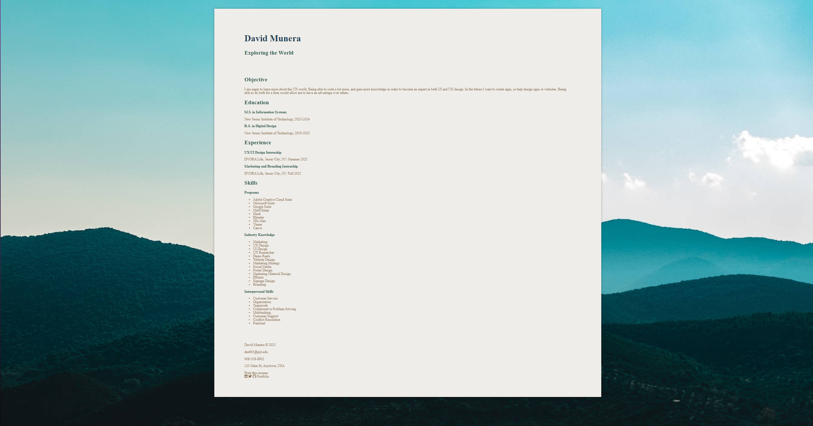

# David Munera's Styled Resume

When designing my resume, I chose to use the "Sage" archetype. The sage is the seeker of truth, wisdom, and knowledge. They strive to understand the world but are very patient, calm, and rational which is why I chose this archetype.

I chose three different fonts that I felt fit the sage archetype well. The "Avenir Next" font for my name at the very top, "Dosis" for subheadings, and "Big Caslon" for regular text. I felt that these three fonts really gelled well together in a manner that got the point across but not so in your face.

For my color scheme, I wanted to convey someone who is traveling somewhere peaceful and is really one with the world. I used colors #224257, #2d5b51, and #927450 to bring an earthy but calming feeling to my resume. I felt that these colors really portrayed the world because it has the shades of blue, green, and brown for when you are walking through a forest or a trail you see these colors the most. My background is #efede9 because I did not want an all-white background, but more of an off-white soothing color.

The background image of a very blue forest because the sage archetype tends to mesh well with blue tones. I felt this background was perfect because the forest also depicts enjoying your environment and the world itself.

All in all, through my design choices I felt that I depicted the "Sage" archetype very well. Hope you feel the same and enjoy my resume!
